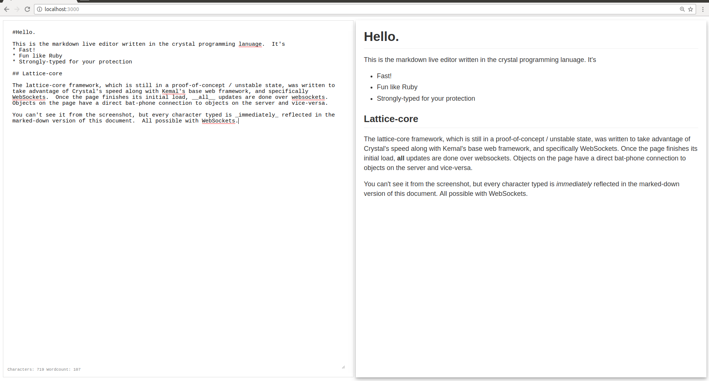

# md_live

A demo for the lattice-core framework.  With less than a hundred lines of code, you have a live-updating markdown document editor that shows changes side-by side.  All rendering is done at the server.  It's even collaborator-ready:  just go to a url, and tell someone else to go to the same url, and you'll both be editing the same document in real-time.

It's hard to explain without video, but here's a screenshot:

## Installation

clone it, run shards install, and then run `crystal src/md_live.cr`

## Usage

Go to `localhost:3000/` and you'll be editing a document that only you can see (it's tied to your session)

Go to `localhost:3000/[some_name]` and a new document will be created that can be editing live along with anyone else that goes to the same url.

## Contributors

- [[jasonl99]](https://github.com/jasonl99) Jason Landry - creator, maintainer
